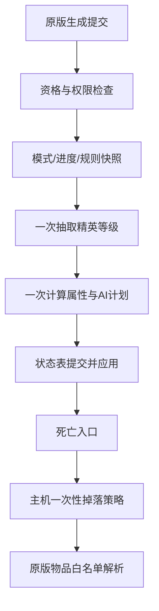

# Origin Rewrite｜起源重构

这是基于 v0.4 设计文档的 C11 实现。项目采用“原版 NPC + 运行时精英状态”的方式，保留原版 AI/掉落作为底层链路，并在手机版 TEFKernel/KernelLoader 上接入经过目标版本验证的原生 Hook。

当前 `0.2.7-p0-generation-gate`（versionCode `2026090428`）按设计文档 v0.5 调整生成顺序：`SetDefaults` 只记录 pending 和原版基准，只有已精确校验并安装的 `NPC.AI()` Postfix 在观察到 `active=true` 后才允许一次 `SpawnCommitted`。此版本新增独立的 `originrewrite_runtime.log`：同时写入模组私有目录和 TEFKernel 导出目录，并通过 `OriginRewrite` logcat 标签输出启动阶段。颜色、名称、`Main.NewText`、NPCLoot、额外掉落和特殊 AI 全部关闭；本版本只验证真实激活入口、一次性状态提交、属性写入/回读和生命周期清理。

诊断记录包含 `vanillaLife`、`finalLife`、`writeOk`、`readbackLifeMax` 和 `readbackLife`。其中 `readbackLifeMax` 与 `finalLife` 相同，才表示最大生命确实写入成功；如果日志包没有包含模组输出，可从 Android logcat 过滤 `OriginRewrite` 标签。

本项目区分“源码包”和“手机安装包”：源码包可以包含 CMake、源码和测试；手机安装包必须把 `Manifest.json` 放在 ZIP 根目录，并把已经编译的动态库放在 `Resources/lib/` 下。不能把源码工程目录直接改名后交给 TEFManager。

## 当前状态

- `or_config.c`：v0.4 的进度、模式、三档精英、同屏上限和安全上限默认值。
- `or_rules.c`：世界规则快照、地形/天气一次采样、规则冲突和统一限幅。
- `or_spawn.c`：主机/单机权限、来源排除、精英概率、模式权重、一次性生成提交。
- `or_stats.c`：从原版最终基准值计算生命、伤害、防御、体型、击退、刷怪占用和金币。
- `or_ai.c`：三档 AI 预算与五阶段状态机；前期终焉关闭，困难模式前期不开放召唤模板。
- `or_state.c`：`PendingInit → SpawnCommitted → Live → DeathStarted → LootCommitted → Cleanup` 生命周期和 `generationId`。
- `or_loot.c`：原版掉落保留、单额外奖励槽、阶段奖励分支、金币唯一后端边界。
- `or_item_registry.c`：只允许显式、已确认的原版物品白名单，拒绝 Boss 袋、Boss 召唤物、未来内容和关键进度物品。
- `or_runtime.c`：TEFKernel PatchLib 的字段精确检查、`SetDefaults` 方法签名精确检查、移动端目标入口探测，以及名称/颜色/公告能力探测。
- `or_adapter.c`：只安装精确校验的 `NPC.SetDefaults(int,bool)` 观察 Hook 和 `NPC.AI()` Postfix；SetDefaults 只保存 pending，AI 首次确认 active 后才提交；AI/NPCLoot 的玩法逻辑、颜色、名称和公告调用仍关闭。
- `or_world.c`：世界规则的版本、配置哈希、规则种子和世界种子指纹校验。

当前 P0 版本只有在 `SetDefaults(int,bool)` 与无参数 `AI()` 均通过精确 ABI 校验并成功安装时才启用生成观察链路；任一入口不可用则关闭重构体升级，不猜测其他重载。

## 固定的不变量

1. `SetDefaults` 只记录 pending 和原版基准，不抽取层级、不提交状态、不修改属性、不消耗活动名额。
2. 只有首次确认 `active=true` 的 AI Postfix 才能执行一次 `SpawnCommitted`；同一对象和 generation 不能重复 roll、重复提交或重复应用属性。AI Hook 未安装或未进入日志时，重构体升级保持关闭。
3. 原版难度和种子修正完成后，读取一次最终基准；所有字段从快照重新计算，不能每帧重复乘算。
4. 传奇（天顶世界）使用独立配置，不再额外叠加大师配置；旅行模式使用普通属性和普通等级权重，再应用独立概率倍率。
5. 进度 × 精英等级属性表是唯一的阶段属性来源；全局等级配置只保存防御、体型、金币、击退和刷怪占用等通用值。
6. 世界规则、地形、天气和事件只在生成提交点写入 `OR_RuleSnapshot`，已生成精英不会因被拖动或天气变化而再次强化。
7. 终焉种只选一个互斥模板；相位最多 3～5 发窄扇形攻击，召唤最多 2 只，狂怒只在首次跨过 25% 生命阈值触发。
8. 掉落先验证主机/单机权限，再原子设置 `lootCommitted`；客户端不生成额外物品或金币。
9. 金币只允许修改已确认的原版 `NPC.value` 后端；没有确认后端时保留原版金币并关闭额外金币，不手动造第二份钱。
10. 宝匣和装备/饰品不写死物品 ID。只有 `OR_ItemRegistry` 收到目标版本已确认的原版白名单后才能实际解析奖励；解析失败必须回退阶段材料。

## 模块关系



## 构建和测试

在安装了 CMake 的环境中：

```bash
cmake -S . -B build -DORIGINREWRITE_BUILD_TESTS=ON
cmake --build build
ctest --test-dir build --output-on-failure
```

TEFKernel API 路径可以通过 `-DORIGINREWRITE_MOD_API_DIR=/path/to/mod-api` 指定。Android ARM64 构建必须使用 `arm64-v8a`，输出名遵循手机版 TEFKernel 模板：

```text
libOriginRewrite.android.arm64.so
```

安装包的根目录必须是：

```text
OriginRewrite-android-arm64.zip
├─ Manifest.json
├─ Info.json
├─ OriginRewrite.json
└─ Resources/
   └─ lib/
      └─ libOriginRewrite.android.arm64.so
```

在带 Android SDK/NDK 的环境中，运行 `scripts/package_android_arm64.sh` 会先构建 ARM64 动态库，再生成上述可导入 TEFManager 的 ZIP。`.github/workflows/android-arm64.yml` 提供相同的 GitHub Actions 流程。

本工作区未安装 CMake，已用系统 C11 编译器完成纯核心测试和共享库链接检查；vendor API 头文件本身产生的 ISO C pedantic 警告不属于 Origin Rewrite 源码错误。

## 当前接入结果与下一阶段

已完成：真实 NPC `SetDefaults` Hook 的 pending 记录、精确的 `SetDefaults(int,bool)` ABI 门槛、AI Postfix 激活门槛、独立运行日志和槽位复用清理。当前版本不安装 NPCLoot Hook，也不执行颜色、名称或公告调用；只有真实 active AI 回调才会进行一次属性提交。

下一步：

1. 对 `Item.NewItem` 完成目标版本精确签名校验和原版物品/装备/饰品/宝匣白名单；在验证完成前不启用额外掉落。
2. 对死亡入口做前后顺序验证；在顺序不确定时继续只保留原版掉落。
3. 接入真实玩家位置、地形、天气快照；当前安全默认值是地表森林、晴天、白天。
4. 在手机端测试普通、稀有、传奇三档体型、金币、属性和多人客户端不重复结算。

`Resources/config/README.md` 说明了为什么资源 JSON 在原生资源接口确认前不会被伪装成“已加载”。
