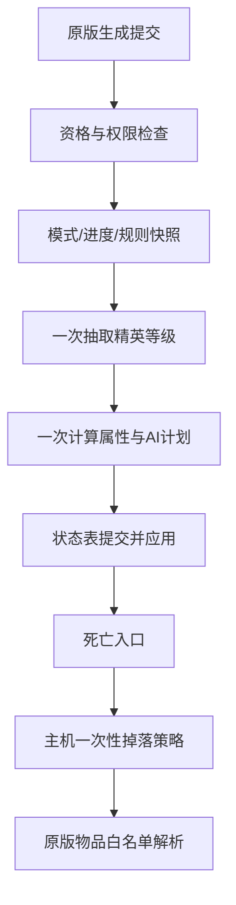

# Origin Rewrite｜起源重构

这是基于 v0.4 设计文档的 C11 架构首版。项目采用“原版 NPC + 运行时精英状态”的方式，目标是先把可验证的纯核心逻辑固定下来，再接入手机版 TEFKernel/KernelLoader 的原生 Hook。

本项目区分“源码包”和“手机安装包”：源码包可以包含 CMake、源码和测试；手机安装包必须把 `Manifest.json` 放在 ZIP 根目录，并把已经编译的动态库放在 `Resources/lib/` 下。不能把源码工程目录直接改名后交给 TEFManager。

## 当前状态

- `or_config.c`：v0.4 的进度、模式、三档精英、同屏上限和安全上限默认值。
- `or_rules.c`：世界规则快照、地形/天气一次采样、规则冲突和统一限幅。
- `or_spawn.c`：主机/单机权限、来源排除、精英概率、模式权重、一次性生成提交。
- `or_stats.c`：从原版最终基准值计算生命、伤害、防御、体型、击退、刷怪占用和金币。
- `or_ai.c`：三档 AI 预算与五阶段状态机；前期终焉关闭，困难模式前期不开放召唤模板。
- `or_state.c`：`PendingInit → SpawnCommitted → Live → DeathStarted → LootCommitted → Cleanup` 生命周期和 `generationId`。
- `or_loot.c`：原版掉落保留、单额外奖励槽、阶段奖励分支、金币唯一后端边界。
- `or_item_registry.c`：只允许显式、已确认的原版物品白名单，拒绝 Boss 袋、Boss 召唤物、未来内容和关键进度物品。
- `or_runtime.c`：TEFKernel PatchLib 的字段精确检查和方法签名精确检查。
- `or_world.c`：世界规则的版本、配置哈希、规则种子和世界种子指纹校验。

首版不会猜测 NPC 生成、死亡或掉落方法签名。`or_runtime_probe()` 只探测可验证的 `Terraria.NPC` 类型和字段；在精确签名没有配置前，`gameplay_enabled` 保持关闭，模组不会修改游戏内 NPC。这是预期的安全门，不是漏写的开关。

## 固定的不变量

1. 原版 `SetDefaults` 只可用于记录待初始化状态，不能抽精英、改属性或增加精英计数。
2. 只有“非激活→激活”或已验证的实际生成提交点才允许调用 `or_spawn_try_commit()`。
3. 原版难度和种子修正完成后，读取一次最终基准；所有字段从快照重新计算，不能每帧重复乘算。
4. 传奇（天顶世界）使用独立配置，不再额外叠加大师配置；旅行模式使用普通属性和普通等级权重，再应用独立概率倍率。
5. 进度 × 精英等级属性表是唯一的阶段属性来源；全局等级配置只保存防御、体型、金币、击退和刷怪占用等通用值。
6. 世界规则、地形、天气和事件只在生成提交点写入 `OR_RuleSnapshot`，已生成精英不会因被拖动或天气变化而再次强化。
7. 终焉种只选一个互斥模板；相位最多 3～5 发窄扇形攻击，召唤最多 2 只，狂怒只在首次跨过 25% 生命阈值触发。
8. 掉落先验证主机/单机权限，再原子设置 `lootCommitted`；客户端不生成额外物品或金币。
9. 金币只允许修改已确认的原版 `NPC.value` 后端；没有确认后端时保留原版金币并关闭额外金币，不手动造第二份钱。
10. 宝匣和装备/饰品不写死物品 ID。只有 `OR_ItemRegistry` 收到目标版本已确认的原版白名单后才能实际解析奖励；解析失败必须回退阶段材料。

## 模块关系



## 构建和测试

在安装了 CMake 的环境中：

```bash
cmake -S . -B build -DORIGINREWRITE_BUILD_TESTS=ON
cmake --build build
ctest --test-dir build --output-on-failure
```

TEFKernel API 路径可以通过 `-DORIGINREWRITE_MOD_API_DIR=/path/to/mod-api` 指定。Android ARM64 构建必须使用 `arm64-v8a`，输出名遵循手机版 TEFKernel 模板：

```text
libOriginRewrite.android.arm64.so
```

安装包的根目录必须是：

```text
OriginRewrite-android-arm64.zip
├─ Manifest.json
├─ Info.json
├─ OriginRewrite.json
└─ Resources/
   └─ lib/
      └─ libOriginRewrite.android.arm64.so
```

在带 Android SDK/NDK 的环境中，运行 `scripts/package_android_arm64.sh` 会先构建 ARM64 动态库，再生成上述可导入 TEFManager 的 ZIP。`.github/workflows/android-arm64.yml` 提供相同的 GitHub Actions 流程。

本工作区未安装 CMake，已用系统 C11 编译器完成纯核心测试和共享库链接检查；vendor API 头文件本身产生的 ISO C pedantic 警告不属于 Origin Rewrite 源码错误。

## 下一阶段接入顺序

1. 针对目标手机版本确认真实生成提交方法的所属类型、实例标记、返回类型和每个参数类型；确认后才安装 Hook。
2. 确认死亡 Hook 位于原版掉落前还是后；不确定时只保留原版掉落。
3. 用真实字段验证 `lifeMax/life/damage/defense/knockBackResist/scale/value/npcSlots`，缺少 `defDamage/defDefense` 时继续使用状态表，不猜字段。
4. 建立目标版本的显式原版物品、装备、饰品和宝匣 ID 白名单，再启用 `or_item_registry_pick()`。
5. 实现 TEF 资源读取和世界数据序列化，使 `general.json`、`tiers.json`、`ai.json`、`loot.json`、`rules.json` 各自只有一个权威来源。

`Resources/config/README.md` 说明了为什么资源 JSON 在原生资源接口确认前不会被伪装成“已加载”。
