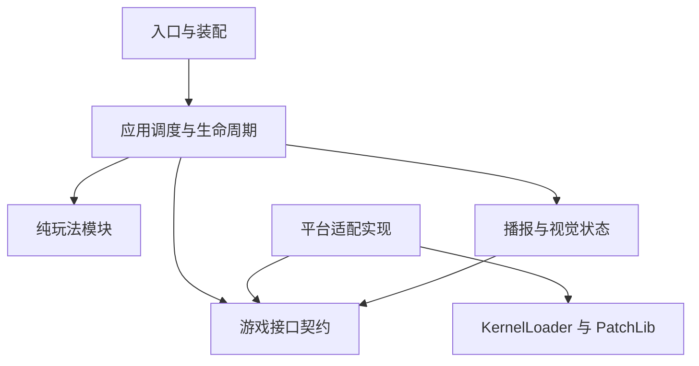

# OriginRewrite KernelLoader 架构重制与 AI 执行规范

版本：v1.1 整合稿｜日期：2026-10-03

用途：交给 AI 执行源码审计、独立架构设计、分阶段重写及验收。

依据：用户上传的《OriginRewrite-KernelLoader-架构重写设计文档-v1.0.md》、OriginRewrite v1.1.0 源码，以及本次重写要求。

本文规定重写目标和执行流程，不代表新版已经编码完成或通过真机测试。文档版本与将来模组版本分别管理。

## 1. 目标与范围

核心目标：保留需要的玩法和已验证的平台能力，重新设计职责、状态归属及通信接口，使新增机制不再依赖修改巨型适配器。

### 1.1 保留与重建

| 系统 | 本次要求 |
| --- | --- |
| 普通敌怪精英体系 | 保留三档重构体及既有配置中的等级、概率、属性预算；重新实现提交和生命周期 |
| 世界规则 | 保留抽取、互斥、轮换、历史；实现独立贡献和统一合并 |
| 环境修正 | 保留地形、深度、天气、昼夜、世界进度和难度，生成时冻结快照 |
| 普通精英附加 AI | 保留五阶段动作思路、类型适配、冷却和预算；重写调度及动作接口 |
| 掉落 | 原版掉落优先，额外奖励按白名单和进度过滤，去重提交 |
| 名称、脚下特效 | 保留已有资源和可验证行为，重写缓存、失效和清理 |
| 普通播报 | 世界、地形、精英、预警及奖励信息；支持档位、去重、冷却 |
| Boss 战斗对话 | 保留，增加独立开关；作为观察和表现功能，不改 Boss 行为 |
| 配置、持久化、日志、构建 | 保留必要兼容性，重建明确格式、版本和责任边界 |

### 1.2 Boss 范围的最终约定

1. **保留 Boss 战斗对话信息，并提供 `enableBossDialog` 独立开关，默认开启。**
2. 对话涵盖出现、战斗阶段、击败等已确认事件；旧版目录中存在的重复击杀、玩家死亡及重复死亡文案和计数，在审计后明确保留范围，不能声称未验证事件已完成。
3. 不重写 Boss AI，不新增 Boss 攻击、弹幕、召唤、属性强化或奖励机制。
4. 普通精英生成仍须排除 Boss、Boss 肢体与已确认的 Boss 召唤物。
5. 关闭对话只停止本模组 Boss 对话的生成和展示；不改变原版 Boss 行为，也不影响普通精英、规则、掉落。
6. Boss 是否在场可以用于本模组低优先级播报抑制；不要求替换或锁住原版聊天系统。

### 1.3 延后范围

多人同步、其他 CPU 架构、自定义物品和音乐不作为首版要求。已有贴图资产继续使用，不因“暂不新增资产”被删除。

原文的存活型规则、可逆局部世界结构规则保留为后续扩展阶段；核心闭环稳定之前不接入世界结构修改，也不为它预先搭建复杂框架。

目标运行环境沿用原文：Android ARM64 单机、KernelLoader/TEFKernel。原文列出的 Terraria 1.4.5.8.6 和 1.4.4.0 起兼容范围属于目标，不是已验证结论；实施前核实实际游戏和内核版本，逐版本记录结果。

## 2. 旧版证据与本次修订

对上传源码的目录及关键路径检查得到：

| 文件 | 本附件行数 | 观察 |
| --- | ---: | --- |
| `src/platform/tef/or_adapter.c` | 4025 | 平台调用、绑定、规则、生成、AI、掉落、Boss 对话和表现集中 |
| `src/platform/tef/or_runtime.c` | 2732 | 大量运行时字段、方法和能力探测集中 |
| `src/core/or_rules.c` | 410 | 规则计算需要进一步按输入、贡献和合并拆分 |

这些行数与原文部分统计不同，以本附件为准。这里只完成结构和关键调用检查；每个具体故障的根因仍需审计或日志证据，不能仅凭文件大小认定。

| 原文内容 | 本文修订 |
| --- | --- |
| 保留资产、重写骨架 | 增加功能规格提取、独立设计和复用登记，避免函数搬家 |
| 所有业务依赖 platform | 纯规则和属性计算不依赖游戏 SDK；通过抽象接口接入平台 |
| 每 tick 一个 Context | 区分世界快照、玩家环境和 NPC 快照，明确生成时采样基准 |
| 提交失败直接放弃 | 区分写入前失败与部分写入失败，规定补偿和诊断 |
| 能力仅用布尔值描述 | 增加状态、签名/布局验证、失败原因和版本证据 |
| 规则事件总线 | 首版采用有限事件和显式顺序，不做任意异步订阅框架 |
| 无文件超过 1000 行 | 行数作为复查信号，状态归属和扩展改动范围才是主要验收 |
| 迁移按固定周数推进 | 按可运行交付和验收推进，不把原估算工期当承诺 |

## 3. 防止 AI 照搬的执行流程

### 3.1 先提规格，再做架构

审计阶段只提取下列三种内容：

| 内容 | 提取方式 |
| --- | --- |
| 功能规格 | 输入、触发条件、输出、边界、开关、玩家可见行为 |
| 平台事实 | 实际签名、参数和返回布局、Hook 时机、句柄有效期、验证版本与依据 |
| 问题清单 | 复现步骤、日志、已确认原因、未确认假设及重写验收场景 |

所有功能标记为“文档要求 / 源码存在 / 有日志证据 / 有真机结果”。源码存在不等于生效，文档声明不等于已经验证。旧版实际行为若与目标冲突，登记差异，不自动作为正确规格。

审计输出应短而具体：功能矩阵、平台接口清单、依赖与状态归属表、已知问题、待核实项。不要求先生成大量空文档。

### 3.2 独立设计

推荐用两个连续工作上下文：第一阶段读取旧源码并提取规格；第二阶段以规格和平台事实为主要输入，独立设计新版。确需查看旧代码时，按接口或行为查阅具体片段。

这是降低旧实现影响的方法，不是必须更换模型。允许使用同一 AI，但要求先完成规格和接口设计，再开始功能实现。

### 3.3 复用边界

允许保留：第三方 SDK、许可证、资源、经确认的接口签名、必要 ABI 兼容代码、白名单数据、文案及经过验收的配置值。

必须重新设计：巨型回调、跨功能全局状态、混合的提交与表现流程、状态清理依赖、规则合并与动作调度。

每处业务代码复用记录旧路径、新位置、复用理由和验证方式。禁止把旧函数整体复制、改名或拆成多个文件后称为架构重制；不以降低代码相似度为目标，合理的底层兼容代码应保留。

### 3.4 实施约束

1. 新版在独立目录或分支实现，旧版作为只读参考。
2. 每阶段交付能编译的完整闭环，禁止以一批空函数和 TODO 作为完成。
3. 先实现一条真实规则和一种真实动作，再决定是否需要更通用接口。
4. 遇到无证据的平台调用，先验证并记录；不能猜签名、参数顺序或对象布局。
5. 后续明确要求开始编码即构成实施授权，不要求每个阶段再次确认；需要真机结果时说明待测项。

## 4. 架构与依赖

采用普通 C 模块、函数表、显式调度及有限事件。首版不引入 ECS、脚本解释器、热插件系统、通用反射注册或复杂消息中间件。

箭头表示代码依赖；平台实现满足游戏接口契约。调度层通过装配好的接口调用平台，纯玩法模块只接受数据并产出决策，不包含 PatchLib 句柄。

| 部分 | 建议目录 | 职责 | 禁止 |
| --- | --- | --- | --- |
| 入口 | `src/entry/` | 配置、装配、启动和停止 | 直接实现玩法 |
| 应用调度 | `src/app/` | 固定调用顺序、提交、命令校验和生命周期 | 保存所有功能的私有状态 |
| 游戏契约 | `include/ports/` | 快照读取、属性提交、工厂、文字输出的类型化接口 | 暴露托管对象指针给纯玩法 |
| 平台适配 | `src/platform/tef/` | 探测、Hook、原生读写、句柄生命周期 | 决定精英概率或规则效果 |
| 纯玩法 | `src/domain/` | 规则、合并、属性、候选、AI 计划和掉落决策 | 读写游戏字段、文件和渲染对象 |
| 表现 | `src/presentation/` | 对话观察、播报调度、名称和视觉快照 | 决定属性、掉落或攻击 |
| 配置与持久化 | `src/storage/` | 校验、格式迁移、世界存档和原子写入 | 保存原生对象句柄 |

只为真实职责创建文件，目录不要求预先填满。平台写入封装是必需的，但它只执行经授权的命令，不主动决定属性。

## 5. 状态所有权与核心契约

### 5.1 状态归属

| 状态 | 唯一管理者 | 清理时机 |
| --- | --- | --- |
| Hook ID、字段/方法句柄、平台能力 | platform | 卸载、初始化失败或平台重新绑定 |
| 世界会话、NPC 身份和生成代次 | lifecycle | 换世界、对象复用、消失、卸载 |
| 当前规则组合、轮换时钟和历史 | world_rules | 会话结束；需要保存的内容单独序列化 |
| 每只精英的冻结快照和提交状态 | elite_store | 死亡/消失后按掉落边界完成清理 |
| 动作阶段、冷却和技能预算 | ai_runtime | 动作取消、死亡、复用、世界结束 |
| 奖励计划、发放尝试和已提交标记 | loot_runtime | 结算结束或世界结束 |
| Boss 遭遇、阶段标记及对话计数 | boss_dialog | 遭遇结束、身份失效、换世界；持久计数单独保存 |
| 播报队列、去重和展示占用 | notice | 过期、关闭通道、世界结束 |
| 脚下特效及名称展示缓存 | visuals | 死亡、失活、代次不匹配、世界结束 |

入口可以装配包含模块实例的根对象，但不得将其变成所有模块可修改的“万能全局结构”。模块私有状态通过自己的接口修改，其他模块使用只读快照或事件。

### 5.2 数据契约

| 契约 | 必需信息 |
| --- | --- |
| `OR_EntityKey` | 世界会话 + 已确认的 NPC 标识/槽位 + 生成代次；不以指针或 type 单独标识 |
| `OR_CapabilityReport` | 能力 ID、验证状态、签名/布局结论、失败原因、对应游戏/内核版本 |
| `OR_WorldSnapshot` | tick、世界会话、稳定世界身份、进度、难度、天气、昼夜和有效性 |
| `OR_PlayerContext` | 玩家身份、位置、环境、存活和字段有效性 |
| `OR_NpcSnapshot` | 实体键、类型、原版 AI 分类、属性、位置、状态、来源可信度 |
| `OR_EffectContribution` | 来源 ID、允许修改的字段、倍率/加值/偏好与优先级 |
| `OR_SpawnPlan` | 资格、抽取结果、层级、最终属性、冻结规则、动作计划和能力要求 |
| `OR_GameCommand` | 目标实体键、操作类型、负载、前置条件、执行结果 |
| `OR_DomainEvent` | 事件类型、实体/遭遇身份、tick、必要数据和去重标识 |
| `OR_RenderSnapshot` | 可绘制对象、位置、样式和有效身份，不持有需要临时探测的托管对象 |

结构体的具体字段在设计阶段落实到头文件；本文给出语义约束，不要求照搬旧结构体布局。

### 5.3 快照与采样

世界数据在可用的全局更新点每 tick 缓存一次；没有验证过的全局 Hook 时，可在首个相关回调中刷新并按 tick 去重，不把 NPC 回调次数当作时间。

环境效果首版沿用原文的玩家所在地基准。玩家上下文与 NPC 快照分开，不能把一份世界 Context 当作所有 NPC 的位置。未来若切换为 NPC 所在地，必须作为明确行为变更。

字段读取失败使用“未知/无效”，不能把失败当成 false、0 或某个默认地形。世界、环境和规则快照在精英提交时冻结；已有精英不会因后来换地形、换规则而重算生成属性。

### 5.4 平台能力与安全边界

能力状态至少区分未探测、可用、不支持、验证失败和运行时失效。启动时验证可获得的元数据；世界进入后才能获得的数据采用延迟绑定，并在身份变化时失效。

功能声明能力要求，平台调用仍校验句柄和对象存活。布尔能力标记不能代替精确签名及返回布局检查，也不能保证捕获原生崩溃。未经确认的方法禁用，不能通过“尝试调用看看”验证。

可选能力缺失只关闭对应功能，例如弹幕工厂缺失不阻止属性精英；必要能力缺失阻止相应提交。保留已验证的对齐返回缓冲区等兼容措施，不为追求代码简短删除。

## 6. 规则隔离与效果合并

### 6.1 独立贡献

世界、地形、天气、难度、进度及词缀各自产出贡献，不读写其他来源的贡献，也不改最终快照。每条规则只计算自己的效果；调度层统一汇总。

地形规则定义声明允许修改的字段。例如某条规则只声明伤害，其输出不得偷偷修改生命、奖励或 AI 强度。具体字段以审计后的规则规格为准，不能将原文中的荒漠/雪原举例直接当作真实平衡值。

### 6.2 合并语义

1. 规范来源顺序：世界 → 地形 → 天气/昼夜 → 难度 → 进度 → 层级/词缀。没有某类贡献时用中性值。
2. 普通倍率相乘、加值相加；防御定义为基础值乘合并倍率后加固定值，统一取整。
3. 原版基准已包含的难度修正不得再乘一次；R0 明确“基础值”的读取时点和含义。
4. 概率、奖励、层级权重分别使用自己的约束；权重过滤后归一化，空池有明确降级。
5. 元素偏好、动作覆盖等非交换效果使用显式优先级，再以稳定来源 ID 决胜。
6. 在统一合并点限制效果；最终属性计算再执行生命、伤害等各自硬上限。非法值、NaN 和无穷值拒绝或按明示策略降级。
7. 所有输入先规范排序，合并期间不依赖注册顺序。浮点结果按规定容差比较，不要求跨平台按位完全一致。

### 6.3 隔离与随机数

世界规则抽取、NPC 精英抽取、AI 选择和奖励选择使用独立且可复现的随机流。关闭播报或新增文案不得消耗玩法随机数。

规则从合法池抽取 2–4 条，满足互斥及类别约束；候选不足时明确减少数量并记录原因。多次抽到两条不单独构成故障，也不要求两个世界的组合必然不同。

规则轮换以真实游戏时钟为依据，避免随 NPC 数量加速。轮换只影响后续生成。首版地形规则以每个地形一项清晰主机制控制复杂度，扩展时声明预算和修改字段。

### 6.4 注册与有限事件

规则定义包含 ID、类别、互斥标签、条件、效果计算和必要生命周期函数。输入只读，输出为贡献或明确请求；禁止跨规则调用、写共享结构或直接调用游戏工厂。

事件仅由调度层产生并按固定顺序投递，首版使用有界列表。死亡、消失、世界离开等清理事件不能因队列满被静默丢弃；必要时同步完成清理。事件不能无限递归派生事件。

归因日志只在贡献计算或状态改变时记录，不每帧刷屏：`source=terrain.desert field=damage before=... after=... entity=... revision=...`。日志数值来自真实计算，不填示例常量冒充结果。

## 7. NPC 生命周期与生成提交

### 7.1 生命周期

`Observed → Eligible/Rejected → Planned → Committing → Live → Dead/Despawned → Released`。

每个真实生成代次只完成一次资格判断及抽取。Rejected 状态必须能轻量保留“已经判断”事实，不能因删除绑定导致每次 AI 回调重新抽取，最后几乎全部变成精英。

SetDefaults 是观察信号，不能仅凭它创建永久存活记录。对象重设、槽位复用和世界变化必须使旧代次失效；无法读取真实槽位时，由平台映射给出可验证身份，不把内部绑定表下标冒充游戏槽位。

绑定数量有上限，溢出时拒绝本次附加机制并计数。不能覆盖仍存活的精英；pending、拒绝记录和死亡待结算记录均有独立回收条件，清理不依赖某个可关闭的 AI 技能。

### 7.2 提交流程

| 步骤 | 操作 |
| --- | --- |
| SetDefaults 观察 | 记录身份变化及必要基准，type 无效/模板对象静默跳过 |
| 首次确认活跃的原版 AI 后 | 读取经确认的原版最终基准，检查身份和必要能力 |
| 资格判断 | 排除友好/城镇/Boss/肢体/已确认召唤与不兼容来源 |
| 计划 | 独立随机抽取、汇总效果、计算最终属性、冻结快照与动作计划 |
| 预检 | 验证所有必需字段、值域、句柄、代次和容量 |
| 提交 | 统一执行属性写入并回读；成功后发布精英存活记录 |
| 展示 | 提交成功事件才触发名称、特效与播报 |

原版 AI 保持原有调用，附加动作在后置边界执行，不因对话或表现开关跳过原版逻辑。

### 7.3 部分写入与失败

写入前失败：放弃本次精英提交，释放预留容量，不修改原版。

写入中失败：平台记录已写字段，尝试恢复本次写入前的实际值并校验。只有同一实体身份仍有效时才补偿，不能将旧属性写进已复用对象。无法确认恢复成功时记录明确错误，隔离该提交或能力，不宣称“原版完全未受影响”。

本流程是可校验的补偿提交，不宣称多个游戏字段具有底层原子事务。未经确认的原生调用不能进入该流程。临时免伤、速度覆盖等另有动作结束时的恢复责任，不能只依赖死亡 Hook。

### 7.4 生成来源与 Boss 排除

优先使用已验证的生成来源、父实体或生成工厂信息。平台提供来源及可信度；纯资格规则消费该数据。

不能靠“附近有 Boss”或 NPC type 单独推断所有召唤来源。未知且高风险来源按明确保守策略排除并记录，不能声称已精确识别。关闭 Boss 对话不关闭这些生成保护，也不依赖对话状态判断精英资格。

## 8. 普通精英 AI 与动作执行

沿用 `Ready → Telegraph → Active → Recovery → Cooldown` 的玩家可读流程；状态机语义和动作代码重新实现，不复制旧适配器中的大段分支。

| 内容 | 要求 |
| --- | --- |
| 输入 | NPC 与目标快照、冻结动作计划、tick、能力和只读规则结果 |
| 输出 | 类型化移动、弹幕、召唤或临时防御请求 |
| 时间 | 基于游戏 tick；明确每只实体每 tick 的更新频率 |
| 分类 | 沿用已验证的原版类型/AI 分类证据；未知类型保留原版 |
| 调度 | 同 tick 多动作对速度等同一字段的写入由明确优先级或组合规则裁决 |
| 预算 | 单动作、单实体和全局每 tick 分别限额；同一动作周期只触发一次工厂请求 |
| 取消 | 死亡、失活、换世界、身份失效或关闭技能，结束动作并清理临时效果 |
| 降级 | 缺弹幕、召唤或免伤能力时只停对应动作；原版 AI 和其他可用机制继续运行 |

临时属性修改必须通过明确命令及恢复记录，不允许 AI 模块直接写持久生成属性。同一字段存在其他机制或原版更新时，恢复策略必须尊重当前所有权，不能盲目覆盖新值。

首版先验证一种地面动作和一种飞行动作；对虫体、多节及其他高风险类型继续保持明确兼容范围。手机演示强调预警、动作可读性、数量上限和性能，不为扩展性自动增加复杂技能。

## 9. 掉落、名称和视觉

### 9.1 掉落

原版掉落链先执行，本模组只补充额外奖励，按原文默认最多一个额外奖励结果。金币价值修正属于生成属性计算，掉落模块不再写金币字段。

死亡观察、掉落边界和对象回收分开：死亡即停止动作及视觉；结算所需的纯数据可以短暂保留，完成奖励后清理。消失或离开世界不等于击杀，不能发放奖励。

奖励事务以实体键去重。物品生成返回值须验证实际槽位、类型和数量；返回结果不确定时登记未知结果，不自动重试导致重复奖励。缺少可信掉落边界或工厂能力时禁用额外奖励，不猜测原版是否执行。

### 9.2 名称

展示名称由保留的原名和一次性层级前缀生成，重复提交或对象复用不能叠加前缀，也不能只剩前缀。名称能力不可用时只关闭标记，不阻止精英玩法。

### 9.3 脚下特效

沿用已有三档贴图资源，创建和缓存按实体键管理。死亡确认后立即使视觉缓存失效；渲染时再次检查有效性，达到下一次可用绘制时不继续显示。不能为了等待掉落而保留死亡特效。

游戏线程生成只读绘制快照，渲染路径不临时探测方法、不调用未确认的托管 getter、不修改玩法状态。若两者跨线程，明确使用双缓冲或等效同步，禁止读写竞争。

保留现源码对 `NPC.color` 染色与呼吸脉冲的禁用策略，除非以后有明确重新验证任务。贴图在暗处的表现须确定是否受环境光影响，并给出截图验收；不能把素材颜色当作已满足照明要求。

## 10. 普通播报与 Boss 战斗对话

### 10.1 通道与调度

普通播报支持静音、简洁、标准、详细档位；世界、地形、精英、预警、奖励分别开关。Boss 对话为独立通道，默认开启，可单独关闭。

每条消息包含通道、优先级、实体/遭遇身份、事件类型、去重键、创建 tick 和有效期。队列有容量和过期规则；不能靠无限增长缓存保留消息。

本模组对话展示期间，普通世界/地形/奖励消息默认等待或过期丢弃，避免本模组自己覆盖战斗对话。关键动作预警可以使用独立提示或明确更高优先级，不能被长对话永久饿死。

只控制本模组产生的消息。如果原版消息仍可覆盖输出，应在平台能力范围内改用队列和显示时序，不能凭空承诺锁定原版 UI，也不额外制作复杂界面。

### 10.2 对话观察与身份

对话观察模块只读取 Boss、玩家和战斗事件，不发玩法命令。多部位或多节 Boss 通过确认的映射归为一次遭遇，避免肢体重复发出现和死亡消息。

遭遇键必须区分连续两场同类型 Boss 和同时存在的多个实例，不能只用 boss type 全局数组承载所有战斗状态。哪些组合应视为同一遭遇由审计后的映射决定。

玩家死亡、Boss 击败、脱战及对象消失分别观察；不把“对象不活跃”一律当作击杀。重复击杀和玩家死亡计数的保存范围、重置条件在功能规格中明确，不能因玩家对象换指针误增计数。

### 10.3 独立开关行为

1. `enableBossDialog=false`：不生成、不排队、不展示 Boss 对话；立即清理该通道等待消息和当前本模组展示请求。
2. 必要的遭遇结束及身份清理继续执行，不留下下次开启时复用的旧战斗状态。用于精英排除的来源识别仍由生命周期/平台负责。
3. 重新开启后仅处理后续合法事件，不补播关闭期间的全部历史，也不重新宣布已结束战斗。
4. 静音档位作用于普通播报；是否看 Boss 对话由独立开关决定。“全部关闭”配置同时关闭两者。
5. 关闭普通地形播报不关闭地形效果；关闭 Boss 对话不改变任何玩法结果或玩法随机序列。

### 10.4 文案清单

审计阶段枚举旧版文案和事件映射，保存已确认的完整清单。缺失文案使用简洁通用文字或静默策略；未经验证的事件列为待实现，不虚构已经覆盖全部 Boss 的结论。

## 11. 配置、存档、日志与发布

### 11.1 配置

出厂默认、玩家覆盖和内部存档分开。原文所列配置路径作为拟定约定，实施时核实 KernelLoader 的资源读取和 private_dir 能力；不能假设启动器自动提供设置面板。

| 配置键 | 默认 | 行为 |
| --- | --- | --- |
| `enableElites` | true | 控制新精英生成；已有对象按安全停用策略处理，不丢弃清理 |
| `enableEliteAI` | true | 关闭附加动作并结束临时效果，保留原版 AI |
| `enableExtraLoot` | true | 控制本模组额外奖励 |
| `enableEliteVisuals` | true | 控制脚下特效，不改变属性 |
| `enableBossDialog` | true | 独立控制 Boss 战斗对话 |
| `noticeProfile` | compact | 普通播报档位；支持 mute/compact/standard/detailed |
| `noticeWorld` / `noticeTerrain` / `noticeCombat` | true | 对应普通信息通道 |
| `noticeReward` | rare_only | 奖励播报范围 |
| `noticeSuppressInBoss` | true | Boss 在场时抑制普通低优先级信息；不依赖对话开关 |
| `eliteChanceOverride` | -1 | 测试用，-1 为正常概率；不默认启用高概率 |
| `diagnosticLevel` | normal | 控制诊断数量，支持临时详细模式 |

是否允许游戏中热重载由已验证能力决定。首版可以在进入世界或明确重载点读取文件，不承诺即时设置面板。若支持运行中切换，对话开关必须执行第 10.3 节的队列清理。

未知旧键给出一次兼容提示，配置格式升级有版本号和迁移规则，非法配置不能默默激活测试模式。首版不承诺所有旧私有存档可无损导入。

### 11.2 世界存档

稳定世界身份与本次会话 ID 分离。世界身份优先用已验证的世界唯一标识；不把地形、进度或玩家位置混入永久标识。身份不能可靠获得时明确降级，避免跨世界读取同一规则存档。

按世界隔离规则、种子、轮换进度及必要历史。重新进入同一世界加载应保存的规则；进入不同世界不会借用上一世界规则。持久化采用版本化字段格式，禁止直接 fwrite 含布局依赖或句柄的运行时结构体。

保存使用临时文件及原子替换，在可用平台能力下校验写入结果；读取损坏文件时明确报错并使用安全默认。规则历史有长度限制。

### 11.3 日志

启动日志记录模组版本、构建标识、实际游戏/内核版本及功能能力。提交、清理、合并、掉落和对话分别记录关键事件及失败原因。

日志至少能回答：为什么成为精英、属性来自哪里、动作为何触发、奖励是否提交、消息为何等待或被抑制。正常模式采样并限制每类日志数量，详细模式也要有上限。

### 11.4 构建和交付

保留已验证的 ARM64 构建和打包流程。不同启动器格式只按实际加载器要求打包，不能把 TEFManager 和 KernelLoader 的入口/API 默认当作相同。

版本信息在模组入口、元数据、包名和构建日志中一致，并按所用加载器支持方式递增。压缩包根目录符合其加载规则，交付前列出包内路径检查，避免额外套一层目录导致无法加载。

## 12. 分阶段重写与交付

各阶段以可运行结果推进；工期由接口验证和真机结果决定，不沿用原文固定周数作为交付承诺。

| 阶段 | 工作与交付 | 必须通过的验收 |
| --- | --- | --- |
| R0 规格与平台基线 | 功能矩阵、接口证据、状态归属、最小构建；核实加载器和版本 | 能加载、卸载；只安装必要已验证 Hook，无玩法改写 |
| R1 生命周期 | 世界进入退出、NPC 身份/代次、拒绝标记、绑定回收 | 复用不继承旧状态，模板与拒绝对象不耗尽容量，不重复抽取 |
| R2 精英闭环 | 单一等级、资格、属性计划、提交/补偿、死亡清理 | 同一生成只提交一次；失败不留下虚假精英记录 |
| R3 规则与属性 | 三档等级、贡献合并、世界规则及地形/天气冻结 | 字段隔离、上限、互斥、轮换和独立随机流正确 |
| R4 普通精英 AI | 五阶段调度、一种地面和飞行动作，再逐项接动作库 | 原版逻辑保留、预算可控、取消清理、不因可选能力拖累其他功能 |
| R5 掉落与视觉 | 白名单、奖励去重、名称和脚下特效 | 重复边界不多发；死亡下一次绘制无残留；暗处效果符合规格 |
| R6 播报与 Boss 对话 | 普通队列、档位、对话事件目录、独立开关 | 对话不被本模组低优先级信息覆盖，关闭清队列，多部位不重复 |
| R7 扩展验收与稳定化 | 新增一条规则和一种技能，配置迁移、性能、长时真机验证 | 扩展改动局限在对应实现、注册和必要配置；既有功能无回归 |
| R8 后续规则扩展 | 存活型规则；确有需求后加入可逆局部世界结构规则 | 原版状态可恢复、世界切换不污染，核心闭环无需改写 |

R8 不阻塞基础新版发布，也不在 R0 就预建复杂地形回滚系统。R0–R7 覆盖本次主要重制范围和 Boss 战斗对话。

每阶段报告只需：改了什么、实际验证了什么、哪些待真机验证、日志位置和下一阶段。发布源码时包含构建入口和必要资源，不要求重复附带所有中间审计文档。

## 13. 验收标准

### 13.1 架构和扩展

- 纯玩法不包含 PatchLib、Android 或托管对象句柄。
- 每份可变状态都有唯一管理者，清理不依赖某个表现或技能开关。
- Hook 回调只有数据采集、转交调度和必要执行边界，没有大段规则、AI 与对话混写。
- 新增规则不修改 Hook、掉落或 Boss 对话代码；新增技能不改地形判断或播报队列。
- 关闭表现模块不改变属性、抽取、奖励或动作结果。
- 约 800–1000 行的自有文件触发职责复查；有界静态文案/资产和第三方文件单独评估，不为行数机械拆文件。
- 一个模块扩展确需新底层能力时允许增加对应平台接口，须说明理由；不能用“绝不改其他文件”掩盖真实依赖。

### 13.2 有意义的逻辑验证

| 场景 | 预期 |
| --- | --- |
| 输入贡献乱序 | 规范排序后结果在规定容差内一致 |
| 地形规则只声明伤害 | 生命、奖励和 AI 强度保持同一基准结果 |
| 关闭播报或对话 | 相同输入和种子的玩法结果一致 |
| 重复活跃回调 | 一次抽取、一次提交，不不断提高精英概率 |
| 同槽位新代次 | 不复用旧动作、奖励和视觉状态 |
| 属性第 N 次写入失败 | 写入清单与补偿结果正确，无虚假 Live 状态 |
| 重复死亡/掉落边界 | 额外奖励至多一次，不重复计数 |
| AI 能力不支持 | 对应动作停用，其他可用动作和原版继续 |
| 关闭 Boss 对话 | 待播对话清除，玩法和普通通道不变 |
| 再次开启对话 | 不补播过期历史，不复用已结束遭遇 |

只写验证这些跨模块不变量的必要测试，不为简单包装函数制造大量模拟测试。纯逻辑测试通过不能代替真机 ABI、渲染和 Hook 验证。

### 13.3 真机验收

1. 冷启动、进出世界、死亡复活、卸载和再次加载。
2. 大量生成和清理、绑定接近上限、同槽位复用、长时间没有 NPC 回调。
3. 同一世界重入恢复规则，不同世界存档隔离；2–4 条抽取及合法池不足处理。
4. 规则轮换及地形切换只影响新生成，不修改旧精英冻结属性。
5. 特效死亡立即失效、暗处显示和大量精英性能。
6. 正常 Boss 战、多部位 Boss、重复战斗、玩家死亡；对话开启、关闭及重新开启。
7. 必要能力缺失、可选工厂缺失、失败补偿和配置无效情况下的降级。
8. 在记录型号、游戏/内核版本、配置的条件下，连续游戏至少 2 小时；日志及内存采样无持续单向增长、队列和绑定有界。有限测试不等于证明永不崩溃。

没有测试设备或结果时，将项目标记为“待真机验收”，不能写 PASS。出现闪退优先结合实际日志和最近改动定位，不通过连续叠加猜测补丁掩盖原因。

## 14. 可直接交给 AI 的启动指令

> 按本文件重制 OriginRewrite。先完成 R0：读取附件旧源码，提取功能规格、平台接口证据、状态归属和已知问题，区分文档要求、源码存在与实机验证。以这些规格独立设计新版，禁止通过复制旧大函数、改名或拆文件完成重制。允许保留经核实的 SDK、资源、文案、配置值及必要 ABI 兼容代码，并登记复用理由。保留 Boss 战斗对话及独立开关，不加入自定义 Boss AI 或攻击机制。明确生命周期、提交失败补偿、贡献合并、随机流隔离、对话队列及清理。不要一次重写全部功能，不创建空框架冒充完成。R0 输出可审查结果和最小可加载基线；后续按 R1–R7 逐阶段实现和验证，只有有证据的验证才能标记通过。

若只希望先让 AI 做设计，将最后一句改为：“本轮只输出 R0 审计、架构和接口方案，不写模组实现代码。”本文本身不授权 AI 替用户发布、发消息或执行其他外部操作。

## 15. v1.1 变更摘要

- 整合 v1.0 的地形贡献隔离、生成提交、能力降级、规则注册及迁移思路。
- 增加防照搬流程、独立设计、复用登记、状态归属和实际扩展验收。
- 保留 Boss 战斗对话与默认开启的独立开关，排除自定义 Boss AI 和攻击机制。
- 补齐 NPC 复用与拒绝记录、提交补偿、随机数隔离、世界身份和特效失效。
- 将“拆文件”和固定周期改为明确边界、可运行阶段及可核实证据。
