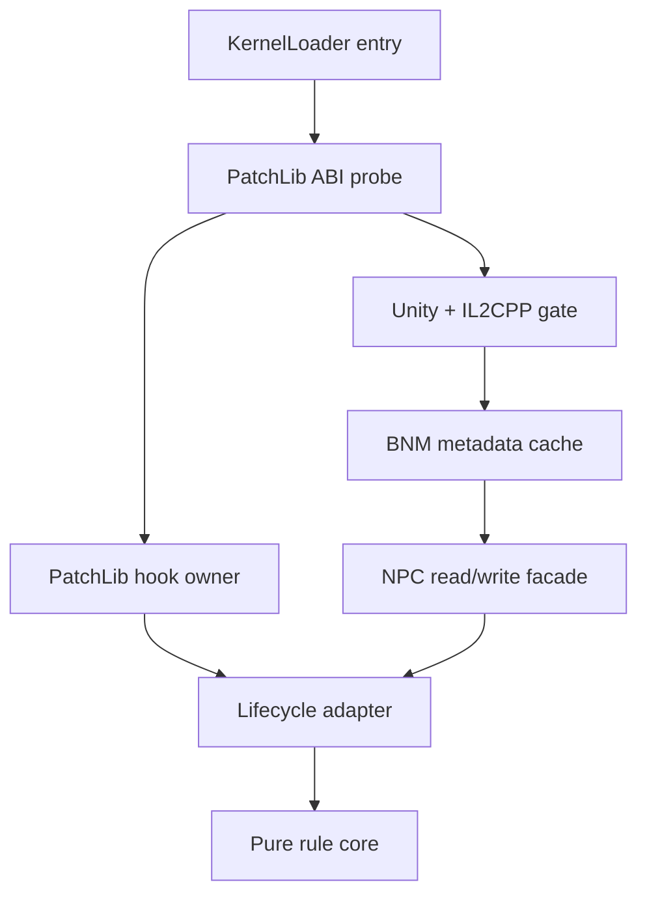

# Architecture

## Composition

BNM and PatchLib do not compete for native hooks. BNM resolves classes, fields and methods by name
and provides the primary scalar NPC accessor. PatchLib verifies target signatures, installs and
uninstalls Prefix/Postfix hooks, and remains a per-call field fallback. The pure core owns decisions
and cannot call either runtime.

## Spawn transaction

1. `NPC.SetDefaults(int32,pointer)` Postfix records the final vanilla baseline as `PendingInit`.
2. No roll, write, announcement or slot reservation occurs in `SetDefaults`.
3. The first verified `NPC.AI()` Postfix with `active=true` is `SpawnCommitted`.
4. Authority, eligibility, cooldown and the independent eight-instance budget are checked.
5. Mode, progression and one frozen rule/terrain/weather snapshot feed one probability roll.
6. One cumulative weighted roll selects `altered`, `calamity` or `apocalypse`.
7. Final stats and an AI budget are calculated once, persisted under
   `worldSessionId + npcSlot + generationId`, and applied once.

Every failure before step 7 clears or retains only safe pending state. A field write failure never
retries multipliers every frame.

## Compatibility gates

| Gate | Required evidence | Failure behavior |
|---|---|---|
| BNM ABI | Unity 2022.2/2022.3 plus required IL2CPP symbols | BNM off, PatchLib fallback |
| Spawn lifecycle | Exact `SetDefaults(int32,pointer)` and parameterless `AI()` | all rewrite rolls off |
| Stats | `type`, `lifeMax`, `life`; optional fields independently checked | missing field skipped |
| Authority | verified `Main.netMode`, or conservative single-player fallback | client decisions denied |
| Broadcast | supported static `Main.NewText` signature | log-only |
| Loot | original NPCLoot ordering + `Item.NewItem` ABI + verified ID registry | vanilla loot only |
| Special AI | target action APIs, position/velocity representation and caps | vanilla AI retained |

## Reward transaction

The state model contains `deathStarted`, `vanillaLootObserved`, `extraLootCommitted`,
`moneyCommitted` and `bossDeathCommitted` boundaries. Original loot always runs first. The pure
policy can choose at most one legal vanilla reward; native spawning is disabled unless the exact
target `Item.NewItem` contract and a versioned item-ID registry are both verified. Money uses only
the final `NPC.value` backend, never a second manual coin grant.

## Configuration ownership

`general.json` is a live overlay for documented scalar switches and probabilities. Other JSON files
are versioned contracts/catalogues for balance, localization and future adapters; compiled core
tables remain the authority until a parser and migration test exists for that schema. Unknown JSON
keys are ignored and all applied values pass through `or_config_validate()`.
